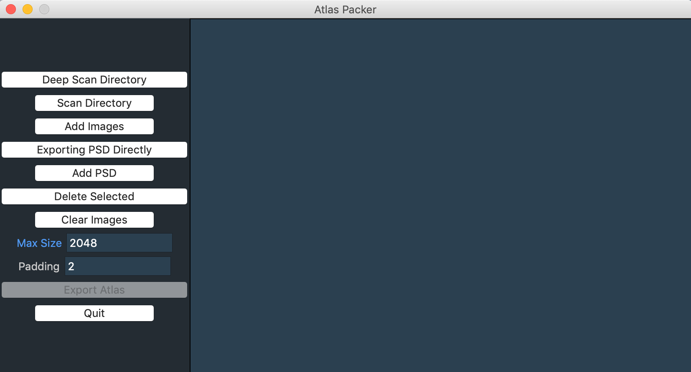
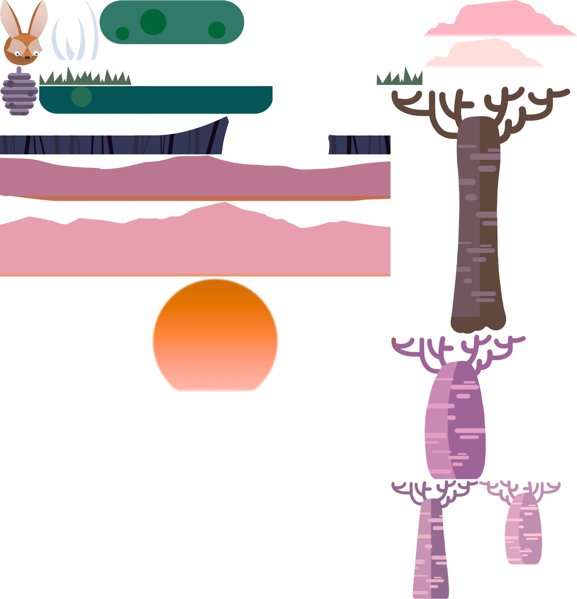
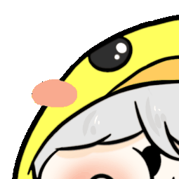
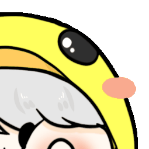

# Susrhuta
Sprite sheet 是常在遊戲開發用的的技術，把小圖片和在一起變成大圖，壓縮 CPU 和記憶體使用。<br>
此專案是免費製作 Sprite sheet 的 UI 程式。

Sprite sheet is a technique use in game developer. <br>
Combine small images to big image, reduce the use of CPU and memory. <br>
This project is a free app that can produce spritesheet.

## Requirement
- Python
    - Pillow
    - TkOuter
    - PSD tools

## Execute
There's two way to execute the program, one is UI mode, another is console mode.<br>

UI start:

```
$ python controller ui
```



### Console Mode
```
$ python controller console --help
```

#### Enviroment parameter

```
-i --images     | Add indivisual image
-f --folders    | Scan the folder
-t --trim       | Trim the image when loading in
--trim-result   | Trim the out put atlas
--result-folder | Result output folder path
--prefix        | Atlas filename prefix
```

#### Example
```
$ python controller console -i image-1.png -i image-2.png
```
```
$ python controller console -i image-1.png -f ~/Desktop -f ~/Document
```
```
$ python controller console -i image-1.png -i image-2.png --prefix atlas-12345
```

#### Result
<br>
 <br>
 

#### More About Sprite Sheet
[SpriteSheets Part.1 Stroage](https://www.youtube.com/watch?v=crrFUYabm6E) <br>
[SpriteSheets Part.2 Performance](https://www.youtube.com/watch?v=_KyUqyS5MLA)